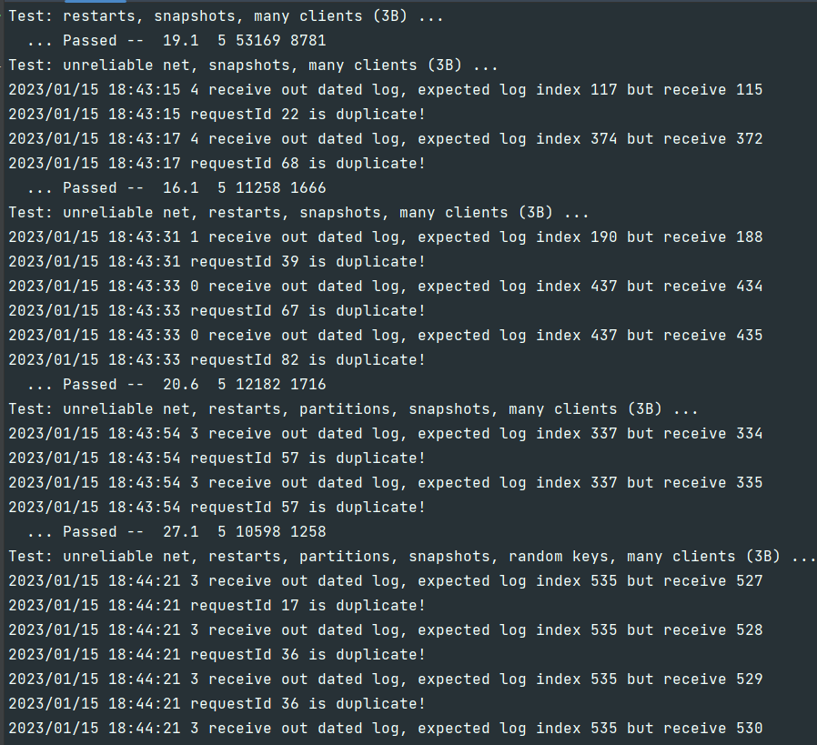

# 实现Raft过程中的一些策略问题
读完raft论文后，对共识算法有了比较清晰的认识；但是论文对具体的实现没有讲得很仔细。
因此在实现Raft过程中，出现的很多问题都是策略问题，而不是机制问题。正是因为有很多可选的实现方案，所以非常让人纠结该选何种实现方式。
举个最简单的例子：大家都知道到达罗马（机制），坐车还是坐飞机，沿途风景如何，乘坐感受如何等等（策略本身的影响）非常让人纠结。
正如英语里的how(机制)和which(策略)一样。 下面则是我在实现Raft过程中的一些思考。

## raft应该怎样向上层的service发送log?
raft将service的操作抽象为一个个log，通过将log在集群中达成共识从而保证系统的强一致性。 而这些达成共识的log（也称为 committed log）需要发送给上层service，让service能够及时执行相关操作。
raft论文对发送log没有详细的描述，因此选择权在于我们。 6.824课程的代码采用的是go语言中的channel，一个发送和接收都是阻塞的实现方式。
现在有了发送的工具，接下来就是要搞懂什么时候该发送log。raft发送log就是在更新`commitIndex`后 ，而只有在以下两种情况中才会更新`commitIndex`：
- follower 收到来自 leader `AppendEntries` RPC调用更新 `commitIndex` 时
- leader 通过对 follower 发起`AppendEntries`或`InstallSnapshot`RPC后，自身更新 `commitIndex` 时

因此有两种方案有发送log：
1. **嵌入式**：将 发送 log 的代码插入到上述两种情况中。 好处是可以及时地将 log 发送给 service，且不需要轮询，节省性能（类似于事件驱动、中断）。
坏处就是阻塞，当前 go routine 需要等待所有 log 发送完成后才能继续执行，延长了rpc执行时间。
2. **独立式**： 将 发送 log 的代码作为一个单独的 go routine，通过轮询的方式来判断是否要发送 log。 好处是代码逻辑独立，降低了耦合，且不容易引发死锁。
坏处就是需要轮询，降低了性能，轮询的间隔时间既不能太大，也不能太小。但是这种情况可以改为使用**条件变量**（go语言中的`sync.Cond`）进行优化。
因此`applyLog`方法可能长这样：
```go
    // raft 初始化时，加入如下字段并初始化
    rf.cond := sync.NewCond(&rf.mu)
    // ...
	for {
        rf.cond.L.Lock()
        for rf.lastApplied >= rf.commitIndex {
            rf.cond.Wait()
			if rf.killed() {
                rf.applyCond.L.Unlock()
                return
            }
        }
		
        // ...
		rf.cond.L.Unlock()
    }
	
	// tester 会调用 kill，因此需要通知其取消Wait()
	func (rf *Raft) Kill() {
        atomic.StoreInt32(&rf.dead, 1)
        rf.applyCond.Signal()
	}
```

在上述两种更新`commitIndex`的情况中，插入`rf.applyCond.Signal()`代码，即可通知`applyLog`发送log：
```go
func (rf *Raft) AppendEntries(args *AppendEntriesArgs, reply *AppendEntriesReply) {
	//...
	// If leaderCommit > commitIndex, set commitIndex = min(leaderCommit, index of last new entry)
	if args.LeaderCommit > rf.commitIndex {
        maxLogIndex := rf.lastIncludedIndex + len(rf.log)
        if args.LeaderCommit < maxLogIndex {
            rf.commitIndex = args.LeaderCommit
        } else {
            rf.commitIndex = maxLogIndex
        }
        rf.applyCond.Signal()
    }
	//...
}

// 第二种情况：leader 向 follower 发送 AppendEntries RPC 后，更新 commitIndex 时，也要调用 rf.applyCond.Signal()
// 具体代码和实现有关，这里就不演示了
```

我选择的是第二种方案，即使用单独的 go routine 来发送 log，因为修改很方便。

### 其他优化
考虑到原方案使用的阻塞式的`channel`，raft发送server需要等待service接收后，才能继续后面的处理。因此可以采用缓冲式的channel来提高raft处理的速度。

### lab之外的思考：向channel一次发送1个log还是多个log？
不管是选用上述哪一种方案，都是在持有锁的情况下，才会发送log，而持有锁的时间与处理log的时间成正比，因此还需要考虑一次发送的 log 数量。
以第二种方案举例，有三种实现方式：
1. 每次轮询时，至多发送1个log。这样做的好处是单次处理时间较短，持有锁的时间也比较短；坏处就是处理log比较慢，而如果要加快速度，则轮询间隔要更小，那么抢锁次数就会增多，加大了抢锁开销，
2. 每次轮询时，尽量发送更多log。好处是一次持有锁的时间可以完成多个log，处理log比较快；坏处就是，其他 go routine 等待锁的时间与处理log时间成正比。
3. 6.824提供的每次轮询时，每次向channel发送log数组，而不是单个log。好处是，向channel发送一次即可处理多个log。

## 为什么需要CondInstallSnapshot？
你可能好奇过raft为什么处理snapshot要靠依靠`CondInstallSnapshot`，你可能去问过搜索引擎，很多人告诉你原因是确保service和raft安装snapshot的原子性。
这个问题其实就是：发送log/snapshot时该不该持有全局锁。很多文章说的没错，持有锁时，能够保证发送log/snapshot是串行的；但会造成死锁；
不持有锁，则发送log和snapshot是并发的，所以需要`CondInstallSnapshot`避免service收到过时的snapshot即可。
前半句是对的，后半句不对。只是简单地不持有锁，然后靠着`CondInstallSnapshot`就能实现service和raft安装snapshot的原子性吗？答案是，并不能。

现在来仔细思考一下这两种情况。
### 发送log/snapshot时持有锁
已经知晓死锁的，可以跳过本部分

假如发送log的go routine全程是持有锁的，那么发送snapshot和发送log是串行的，service就无需过滤过时的log了。为了让raft能及时的释放锁，
service应当持续地接收channel中的消息，也就是说，service接收channel的routine，不应当调用raft并等待调用完成。和网上的一些解答说的一样，service一旦
调用raft的`Snapshot`或`CondInstallSnapshot`就会引发死锁。因此有一个解决办法：开启另一个go routine去调用raft。这样service就持续地接收channel的log。
但是这违背了一开始的设计目标，因为我们就是想先持久化snapshot后再去处理log。

再看课程所给的测试代码：
```go
	for m := range applyCh {
		err_msg := ""
		if m.SnapshotValid {
			if rf.CondInstallSnapshot(m.SnapshotTerm, m.SnapshotIndex, m.Snapshot) {
				//..
			}
		} else if m.CommandValid {
			if m.CommandIndex != cfg.lastApplied[i]+1 {
				err_msg = fmt.Sprintf("server %v apply out of order, expected index %v, got %v", i, cfg.lastApplied[i]+1, m.CommandIndex)
			}
            // ...
		} else {
			// Ignore other types of ApplyMsg.
		}
		if err_msg != "" {
			log.Fatalf("apply error: %v", err_msg)
			// ...
		}
	}
```
测试代码是等待`CondInstallSnapshot`完成，再去处理后续的log。因此我们必须在发送log和snapshot时，不持有锁。


### 发送log/snapshot时不持有锁：
假设发送log的go routine处理顺序：抢锁->获取要发送的log->更新`lastApplied`->释放锁->向channel发送log
`InstallSnapshot`handler处理顺序：抢锁->`lastIncludedIndex of snapshot > lastApplied && lastIncludedIndex of snapshot > rf.lastIncludedIndex`
->如果为真，更新`rf.lastIncludedIndex = lastIncludedIndex of snapshot`->向channel发送snapshot(可以先释放锁再发送)->...

在不持有锁的情况下发送log和snapshot，如果不进行限制的话，则发送是并发的。service接收到snapshot和log的顺序是不确定的，
service可能先接收到snapshot后接收到log，而log是过时的。 然而这个问题并不会影响通过lab3的测试。

为了验证这个假设，可以在lab3的server处理log的方法中插入下面的代码：
```go
if msg.CommandIndex != kv.commitIndex + 1 {
    log.Println(kv.me, "receive out dated log, expected log index", kv.commitIndex+1, "but receive", msg.CommandIndex)
}
```
类似于课程的测试代码，这段代码可以检查serve是否接收到 out-dated log。因此server处理channel的log/snapshot的方法如下：
```go
func (kv *KVServer) apply() {
	for !kv.killed() {
		msg := <-kv.applyCh
		kv.mu.Lock()
		if msg.CommandValid {
			op := msg.Command.(Op)
            if msg.CommandIndex != kv.commitIndex + 1 {
                log.Println(kv.me, "receive out dated log, expected log index", kv.commitIndex+1, "but receive", msg.CommandIndex)
                kv.mu.Unlock()
                continue
            }
            kv.commitIndex = msg.CommandIndex
			commandType := op.OpType
			requestId := op.RequestId
			if id, exists := kv.requestMap[op.ClientId]; !exists || requestId > id {
				if APPEND == commandType {
					//...
				} else if PUT == commandType {
					//...
				} else if GET == commandType {
					//...
				} else {
					//...
				}
				kv.requestMap[op.ClientId] = requestId
			} else {
				// duplicate request
			}
			// ...
		} else if msg.SnapshotValid && kv.raft.CondInstallSnapshot(msg.SnapshotIndex, msg.SnapshotTerm, snapshot){
			//...
			kv.commitIndex = msg.SnapshotIndex
		}
		kv.mu.Unlock()
	}
}
```
这段代码中，server在处理log/snapshot后，会保存对应的`commitIndex`，并与接收到的后一个log进行比较。如果接收到的log的`index != commitIndex+1`，说明raft发送的log不是有序的，则会打印日志消息。
需要注意的是：**server的commitIndex初始化时应当与raft的一致**。
测试结果如下：



即使通过了测试，但打印的日志也表明，raft存在上述提到的问题，但由于service将过时的log被当成重复的请求而过滤了，才没有影响测试结果。
如果上层的service没有这种机制，则service会出问题。

### 如何解决
持有锁能保证串行发送，但service只能另开 go routine 调用`Snapshot`方法；不持有锁，则raft发送log和snapshot的顺序是不确定的。
其实，这个问题的存在有一个前提：**Raft只使用一把大锁**。仔细思考就会发现：**发送log、snapshot和service调用Snapshot方法其实并不冲突**。
因此可以使用更细粒度的锁将这两种操作区分开。 既然我们无法使用大锁去控制串行化，也无法将snapshot和log交给单个go routine去发送，那么我们换个思路，使用一把小锁去控制channel发送。
只有小锁还不够，还需要保证这个锁是**公平锁**才行，这样就能控制发送log/snapshot的顺序了。
我的思路是：发送log/snapshot的go routine先抢到大锁，判断是否满足发送条件；如果满足，则会得到一个发送`order`， 同时递增`order`，随后释放大锁。在发送log/snapshot前，会先抢小锁（这里我用的是**条件变量-sync.Cond**，判断`currentOrder`与`order` 是否一致），如果一致
则发送log/snapshot，并递增`currentOrder`；否则就等待，直到被唤醒。这样就相当于小锁继承了大锁的发送顺序，同时不影响`Snapshot`方法的执行。

类似于以下伪代码：
```go
currentOrder := 1
nextOrder := 1

// 发送log/snapshot的 go routine...
func1 () {
    
    mu.Lock()
    // 检查log/snapshot是否 out-dated...
    order := nextOrder
    nextOrder++
    mu.Unlock()
    
    cond.L.Lock()
    for cuurentOrder != order {
    cond.Wait()
    }
    channle <- message
    currentOrder++
    cond.Broadcast()
    cond.L.Unlock()
}
```
由于`cond`的存在，发送log和发送snapshot是由`order`确定发送顺序的，后发送的log/snapshot只有比前发送的log/snapshot要新（lastIncludedIndex > index of log），才有资格获取发送`order`。
如此一来，当service收到的snapshot必定不会是out-dated，可以直接安装snapshot，而不需要调用`CondInstallSnapshot`（直接返回true）。service调用`Snapshot`方法所带来的死锁问题也因为
发送log/snapshot不持有大锁迎刃而解了。
在raft类中添加几个字段，并在初始化时设置这些字段即可：
```go
type Raft struct {
    //...
    sendOrderCond *sync.Cond // condition for sendOrder
    sendOrder     int64      // which order can send log/snapshot to applyCh
    nextOrder     int64      // the next order a go routine will get
    
    applyCond *sync.Cond
    applyCh   chan ApplyMsg // for raft to send committed log and snapshot
    
	//...
}
func Make(...) *Raft {
	//...
	rf.applyCond = sync.NewCond(&rf.mu)
    rf.sendOrder = 0
    rf.nextOrder = 0
    rf.sendOrderCond = sync.NewCond(&sync.Mutex{})
	//...
}
```
最终的`applyLog`方法如下：
```go
// applyLog
// a go routine to send committed logs to applyCh
func (rf *Raft) applyLog() {
	for {
		rf.applyCond.L.Lock()
		for rf.lastApplied >= rf.commitIndex {
			rf.applyCond.Wait()
		}
		startIndex := rf.lastApplied + 1
		endIndex := rf.commitIndex
		count := endIndex - startIndex + 1
		messages := make([]ApplyMsg, count)
		// if lastIncludedIndex is -1, then i = lastApplied + 1
		// otherwise, i = lastApplied + 1 - offset
		i := startIndex - rf.lastIncludedIndex - 1
		commandIndex := startIndex
		logTerm := -1
		for j := 0; j < count; j++ {
			logTerm = rf.log[i].Term
			messages[j] = ApplyMsg{
				CommandValid: true,
				Command:      rf.log[i].Command,
				CommandIndex: commandIndex,
				CommandTerm:  logTerm,
			}
			commandIndex++
			i++
		}
		rf.lastApplied = endIndex
		rf.lastAppliedTerm = logTerm
		order := rf.nextOrder
		rf.nextOrder++
		rf.applyCond.L.Unlock()

		rf.sendOrderCond.L.Lock()
		for rf.sendOrder != order {
			rf.sendOrderCond.Wait()
		}
		for _, message := range messages {
			rf.applyCh <- message
		}
		rf.sendOrder++
		rf.sendOrderCond.Broadcast()
		rf.sendOrderCond.L.Unlock()
	}
}
```
`InstallSnapshot`方法代码则如下：

```go
func (rf *Raft) InstallSnapshot(args *InstallSnapshotArgs, reply *InstallSnapshotReply) error {
	rf.mu.Lock()
	reply.Term = rf.currentTerm

	// reply false if term < currentTerm (§5.1)
	if args.Term < rf.currentTerm {
		return nil
	}

	// check some conditions...

	// update raft state...
	
	messages := []ApplyMsg{
		{
			SnapshotValid: true,
			Snapshot:      args.Data,
			SnapshotIndex: args.LastIncludedIndex,
			SnapshotTerm:  args.LastIncludedTerm,
		},
	}
	rf.electionTimeout = randomElectionTimeout()
	order := rf.nextOrder
	rf.nextOrder++
	rf.mu.Unlock()

	rf.sendOrderCond.L.Lock()
    for rf.sendOrder != order {
        rf.sendOrderCond.Wait()
    }
    for _, message := range messages {
        rf.applyCh <- message
    }
    rf.sendOrder++
    rf.sendOrderCond.Broadcast()
    rf.sendOrderCond.L.Unlock()
	return
}
```

### 总结
使用以下测试脚本[test2A-3B.sh](https://github.com/chong-chonga/6.824labs-note-Spring2021/blob/master/test2A-3B.sh)：
```bash
#!/bin/bash
for i in {1..50} ; do
    go test -race
    cd ../kvraft
    go test -race
    cd ../raft
done
```
将结果导入到[result.txt](https://github.com/chong-chonga/6.824labs-note-Spring2021/blob/master/result.txt)得到测试结果
```bash
./test2A-3B.sh > result.txt
```
在测试了几个小时之后，我终止了测试；通过查看`result.txt`发现无一FAIL，且不再出现上述日志，说明该方案可行。
总结一下，这个死锁问题是因为**发送log/snapshot需要的锁和Snapshot的锁冲突，且发送log/snapshot是阻塞的，不能及时释放锁**导致的。 
如果发送log/snapshot是非阻塞的或者两者需要的锁不同，则死锁问题将得到解决；而这里通过将锁细粒度化后解决了冲突，也就解决了死锁问题。
那么是不是可以换个想法？比如发送log/snapshot使用的是非阻塞式的数据结构呢？比如基于条件变量控制的队列？


## 谈谈leader发送heartbeat的优化
在做lab2的时候，leader发送heartbeat的间隔以及follower的electionTimeout都是按照lab2A的指导设置的。即leader发送heartbeat消息是交给一个
单独的go routine（以下简称为routineH）去做的，routineH每隔100ms向followers发送RPC。所有命令达成共识都需要依靠heartbeat，这样的处理逻辑在lab2测试中是不会有问题的，但会在lab3的速度测试中FAIL。
为此，又需要在`Start`方法中提交命令时，立即向followers发送RPC，以快速达成共识。这里很自然就会想到一个问题：当`Start`方法被频繁调用时，routineH还有必要每隔100ms发送heartbeat吗？
显然是不需要的，因为当`Start`被频繁调用时，followers自然不会超时进行选举，routineH也就不需要发送多余的RPC了，节省性能。

为此，可以使用一个数组记录上次发送给followers的heartbeat的时间。每当发送RPC时，就更新这个时间；routineH判断当前时间距离上次发送时间是否大于等于100ms，如果是，则发送，否则就sleep一段时间。

因此，Raft添加了如下字段：
```go
type Raft struct {
	heartbeatSent []int64 // time of last sent heartbeat for other servers (millisecond)
}
```
`Start`方法的代码如下：
```go
func (rf *Raft) Start(command interface{}) (int, int, bool) {
	index := -1
	term := -1
	rf.mu.Lock()
	defer rf.mu.Unlock()
	isLeader := rf.role == Leader
	if isLeader {
        // ...
		if rf.minMajorityVotes < 2 {
			rf.commitIndex = index
		} else {
			for server := range rf.peers {
				rf.heartbeatSent[server] = currentMilli()
				go rf.sendHeartbeatMessage(server, term)
			}
		}
	}
	return index, term, isLeader
}
```
routineH通过一个内循环判断距离上次发送heartbeat的时间，如果达到100ms则发送；否则sleep剩余时间。
```go
// heartbeat sends heartbeat message to server in termN
// leaders starts a heartbeat routine for each follower when it becomes a leader in termN
func (rf *Raft) heartbeat(server int, termN int) {
	for true {
		for {
			rf.mu.Lock()
			if rf.role != Leader || rf.currentTerm != termN {
				rf.mu.Unlock()
				return
			}
			lastSentTime := rf.heartbeatSent[server]
			pastMills := currentMilli() - lastSentTime
			if pastMills >= 100 {
				rf.heartbeatSent[server] = currentMilli()
				rf.mu.Unlock()
				break
			}
			rf.mu.Unlock()
			time.Sleep(time.Duration(100-pastMills) * time.Millisecond)
		}
		rf.sendHeartbeatMessage(server, termN)
		time.Sleep(100 * time.Millisecond)
	}
}
```
这样的代码就能在`Start`被频繁调用时，避免leader发送不必要的heartbeat，降低负载。这样的优化，同样可以在leader的`ticker`方法中使用。


